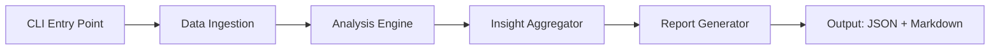
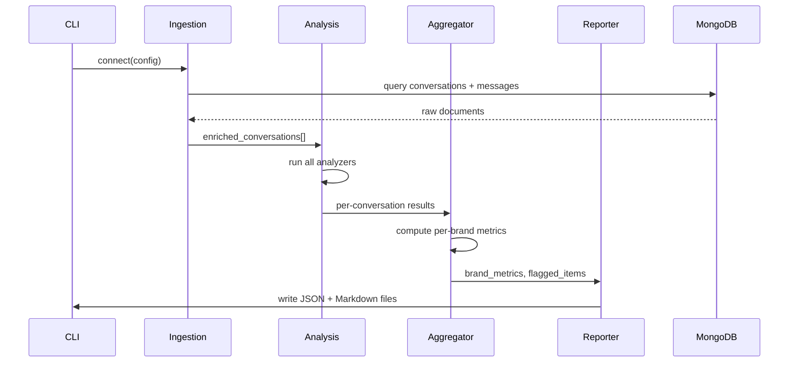

# Design Document: Conversation Analysis System

## Overview

The Conversation Analysis System is a Python-based CLI tool that ingests conversation and message data from a MongoDB database, runs a suite of analyses across brands, and produces structured insight reports. It replaces a manual weekly review process with an automated, repeatable pipeline.

The system is designed to be run on-demand or on a schedule. A single execution is called an Analysis_Run. The user provides MongoDB connection details and optional filters (brand, date range); the system produces both a human-readable Markdown report and a machine-readable JSON report.

### Dataset Setup

The system expects two MongoDB collection dump files to be placed in a `data/` directory at the project root before running:

```
data/
  conversations.json   # MongoDB dump of the conversations collection
  messages.json        # MongoDB dump of the messages collection
```

These files are loaded into the `helio_intern` database using `mongoimport`. The README will include exact import commands. The user does not need to run a live MongoDB instance during development — the import step is a one-time setup.

---

## Architecture

The system follows a linear pipeline architecture with five stages:



Each stage is a distinct module with a clean interface. The CLI entry point wires them together and handles configuration.

### Technology Stack

- Language: Python 3.11+
- Database: MongoDB (via `pymongo`)
- NLP / Sentiment: `transformers` (HuggingFace) or `textblob` for lightweight sentiment; `sentence-transformers` for semantic similarity
- CLI: `click` or `argparse`
- Report rendering: `jinja2` for Markdown/HTML templates
- Property-based testing: `hypothesis`
- Unit testing: `pytest`

### Data Flow



---

## Components and Interfaces

### 1. `ingestion.py` — Data Ingestion

Responsible for connecting to MongoDB, querying, joining, and filtering data.

```python
def load_data(
    mongo_uri: str,
    widget_id: str | None = None,
    date_from: datetime | None = None,
    date_to: datetime | None = None,
) -> list[EnrichedConversation]:
    ...
```

- Connects to `helio_intern` database
- Queries `conversations` collection with optional `widgetId` and `createdAt` filters
- Fetches all messages for matched conversations, grouped by `conversationId`
- Excludes conversations with zero messages (logs a warning per excluded conversation)
- Returns a list of `EnrichedConversation` objects

### 2. `analyzers/` — Analysis Engine

A package of focused analyzer modules. Each analyzer takes an `EnrichedConversation` and returns structured results.

| Module | Responsibility |
|---|---|
| `segmentation.py` | Topic classification, message type separation |
| `dropoff.py` | Drop-off detection, frustration scoring |
| `quality.py` | Relevance scoring, hallucination detection, verbosity flagging |
| `products.py` | Product engagement detection, low-engagement flagging |

Each analyzer exposes a single `analyze(conv: EnrichedConversation) -> AnalysisResult` function.

### 3. `aggregator.py` — Metric Aggregation

Takes all per-conversation `AnalysisResult` objects and computes per-brand metrics and cross-brand comparisons.

```python
def aggregate(results: list[AnalysisResult]) -> AggregatedReport:
    ...
```

- Groups results by `widgetId`
- Computes: total conversations, drop-off rate, frustration rate, response quality score, product engagement rate
- Ranks brands per metric
- Flags outliers (> 1 std dev from mean)
- Classifies systemic vs. brand-specific issues

### 4. `reporter.py` — Report Generation

Renders the `AggregatedReport` into output files.

```python
def generate_report(report: AggregatedReport, output_dir: str) -> None:
    ...
```

- Writes `report.json` (machine-readable, full metrics + flagged items)
- Writes `report.md` (human-readable, summary + per-brand tables + flagged conversations)
- Uses Jinja2 templates for Markdown rendering

### 5. `storage.py` — Trend Storage

Persists per-brand metrics from each Analysis_Run to a local JSON file (or SQLite) for trend comparison.

```python
def save_run(metrics: dict, run_date: datetime) -> None:
def load_runs() -> list[RunRecord]:
```

### 6. `cli.py` — Entry Point

```
python -m cas analyze \
  --mongo-uri mongodb://localhost:27017 \
  --widget-id <id> \
  --date-from 2024-01-01 \
  --date-to 2024-01-31 \
  --output ./output
```

---

## Data Models

### Input Models (from MongoDB)

```python
@dataclass
class Conversation:
    id: str                  # MongoDB _id
    widget_id: str           # Brand identifier
    created_at: datetime
    # ... other fields as present in the collection

@dataclass
class Message:
    id: str
    conversation_id: str
    sender: str              # "user" | "agent"
    message_type: str        # "text" | "event"
    content: str
    created_at: datetime
    metadata: dict           # event metadata, e.g. eventType, productId
```

### Internal Models

```python
@dataclass
class EnrichedConversation:
    conversation: Conversation
    messages: list[Message]  # sorted by created_at ascending

@dataclass
class AnalysisResult:
    conversation_id: str
    widget_id: str
    topic_categories: list[str]
    is_drop_off: bool
    is_unanswered: bool
    frustration_score: float          # 0.0 – 1.0
    flagged_responses: list[FlaggedResponse]
    product_engagement: bool
    low_engagement_product_rec: bool

@dataclass
class FlaggedResponse:
    message_id: str
    flag_type: str                    # "irrelevant" | "hallucination" | "verbose"
    confidence: float                 # 0.0 – 1.0
    reason: str

@dataclass
class BrandMetrics:
    widget_id: str
    total_conversations: int
    drop_off_rate: float
    frustration_rate: float
    response_quality_score: float
    product_engagement_rate: float
    outlier_flags: list[str]          # metric names where this brand is an outlier

@dataclass
class AggregatedReport:
    run_date: datetime
    filters_applied: dict
    brand_metrics: list[BrandMetrics]
    flagged_conversations: list[FlaggedConversation]
    systemic_issues: list[str]
    brand_specific_issues: dict[str, list[str]]
    summary: ReportSummary

@dataclass
class ReportSummary:
    total_conversations: int
    total_brands: int
    overall_drop_off_rate: float
    top_3_issues: list[str]

@dataclass
class RunRecord:
    run_date: datetime
    brand_metrics: list[BrandMetrics]
```

### JSON Output Schema (per flagged conversation)

```json
{
  "conversation_id": "string",
  "widget_id": "string",
  "flag_reason": "string",
  "drop_off": true,
  "frustration_score": 0.72,
  "flagged_responses": [
    {
      "message_id": "string",
      "flag_type": "hallucination",
      "confidence": 0.85,
      "reason": "string"
    }
  ]
}
```


---

## Correctness Properties

*A property is a characteristic or behavior that should hold true across all valid executions of a system — essentially, a formal statement about what the system should do. Properties serve as the bridge between human-readable specifications and machine-verifiable correctness guarantees.*

### Property 1: Message-to-conversation join correctness

*For any* set of conversations and messages, after ingestion every message in the output should be attached to the conversation whose `id` matches the message's `conversationId`, and no message should appear under a different conversation.

**Validates: Requirements 1.2**

---

### Property 2: widgetId filter correctness

*For any* dataset and any `widgetId` filter value, all conversations returned by `load_data` should have `widget_id` equal to the filter value, and no conversation with a different `widget_id` should appear.

**Validates: Requirements 1.3, 2.1**

---

### Property 3: Date range filter correctness

*For any* dataset and any `(date_from, date_to)` pair, all conversations returned by `load_data` should have `created_at` within `[date_from, date_to]`, and no conversation outside that range should appear.

**Validates: Requirements 1.4**

---

### Property 4: Zero-message conversation exclusion

*For any* dataset containing conversations with zero associated messages, those conversations should not appear in the list returned by `load_data`.

**Validates: Requirements 1.6**

---

### Property 5: Message type partition invariant

*For any* `EnrichedConversation`, the set of text messages and the set of event messages should be disjoint, and their union should equal the full message list for that conversation.

**Validates: Requirements 2.2**

---

### Property 6: Topic classification completeness

*For any* conversation that contains at least one user text message, the `topic_categories` field of its `AnalysisResult` should be non-empty.

**Validates: Requirements 2.3**

---

### Property 7: Unanswered conversation flag correctness

*For any* conversation, `is_unanswered` should be `true` if and only if the conversation contains no messages with `sender = "agent"`.

**Validates: Requirements 2.4, 2.5**

---

### Property 8: Drop-off detection correctness

*For any* conversation where the last message (by `created_at`) has `sender = "user"`, `is_drop_off` should be `true`; for any conversation where the last message has `sender = "agent"`, `is_drop_off` should be `false`.

**Validates: Requirements 3.1**

---

### Property 9: Frustration score bounds invariant

*For any* conversation, the `frustration_score` in its `AnalysisResult` should be a float in the closed interval `[0.0, 1.0]`.

**Validates: Requirements 3.3**

---

### Property 10: Drop-off rate computation

*For any* list of `AnalysisResult` objects for a single brand, the computed `drop_off_rate` should equal `count(is_drop_off == True) / len(results)`.

**Validates: Requirements 3.4**

---

### Property 11: Frustration rate computation

*For any* list of `AnalysisResult` objects for a single brand, the computed `frustration_rate` should equal `count(frustration_score > 0.5) / len(results)`.

**Validates: Requirements 3.5**

---

### Property 12: Verbose response flagging

*For any* agent message whose word count exceeds 500, the corresponding `FlaggedResponse` list for that conversation should contain an entry with `flag_type = "verbose"`.

**Validates: Requirements 4.6**

---

### Property 13: Hallucination record completeness

*For any* detected hallucination, the `FlaggedResponse` record should contain a non-empty `message_id`, a `confidence` value in `[0.0, 1.0]`, and a non-empty `reason` string.

**Validates: Requirements 4.4**

---

### Property 14: Response quality score bounds

*For any* brand, the computed `response_quality_score` in `BrandMetrics` should be a float in the closed interval `[0.0, 1.0]`.

**Validates: Requirements 4.5**

---

### Property 15: Product engagement detection

*For any* conversation containing at least one event message with `metadata.eventType = "product_view"`, `product_engagement` in its `AnalysisResult` should be `true`.

**Validates: Requirements 5.1**

---

### Property 16: Product engagement rate computation

*For any* list of `AnalysisResult` objects for a single brand, the computed `product_engagement_rate` should equal `count(product_engagement == True) / len(results)`.

**Validates: Requirements 5.2**

---

### Property 17: Low-engagement alert threshold

*For any* brand whose `product_engagement_rate` is less than `0.10`, that brand should appear in the low-engagement alert section of the `AggregatedReport`.

**Validates: Requirements 5.5**

---

### Property 18: Outlier detection correctness

*For any* set of brand metrics, a brand flagged as an outlier for a given metric should have a value for that metric that differs from the mean of all brands by more than one standard deviation; no brand within one standard deviation should be flagged.

**Validates: Requirements 6.3**

---

### Property 19: Systemic issue classification

*For any* `AggregatedReport`, every issue listed in `systemic_issues` should be present in more than 50% of the analyzed brands, and no issue present in 50% or fewer brands should appear there.

**Validates: Requirements 6.4**

---

### Property 20: Brand-specific issue classification

*For any* `AggregatedReport`, every issue listed in `brand_specific_issues` should be present in fewer than 20% of the analyzed brands, and no issue present in 20% or more brands should appear there.

**Validates: Requirements 6.5**

---

### Property 21: JSON report round-trip serialization

*For any* `AggregatedReport`, serializing it to JSON and then deserializing it should produce an object equal to the original (all fields preserved with correct types).

**Validates: Requirements 7.3**

---

### Property 22: JSON flagged conversation field completeness

*For any* flagged conversation entry in the JSON output, the object should contain all four required fields: `conversation_id`, `widget_id`, `flag_reason`, and the relevant metric values.

**Validates: Requirements 7.4**

---

### Property 23: Run storage round-trip

*For any* `Analysis_Run` whose metrics are saved via `save_run`, a subsequent call to `load_runs` should return a list that includes a record matching that run's date and brand metrics.

**Validates: Requirements 8.1**

---

### Property 24: Week-over-week change computation

*For any* two consecutive weekly `RunRecord` objects for the same brand and metric, the computed WoW change should equal `(new_value - old_value) / old_value`.

**Validates: Requirements 8.2**

---

### Property 25: Directional week-over-week flag correctness

*For any* brand metric where the WoW change is less than `-0.10`, it should be flagged as a regression; where the WoW change is greater than `+0.10`, it should be flagged as an improvement; changes within `[-0.10, +0.10]` should produce neither flag.

**Validates: Requirements 8.3, 8.4**

---

## Error Handling

| Scenario | Behavior |
|---|---|
| MongoDB connection failure | Raise `ConnectionError` with descriptive message; halt Analysis_Run (Req 1.5) |
| Conversation with zero messages | Exclude from analysis; emit `WARNING` log with conversation ID (Req 1.6) |
| No conversations match filters | Produce report with zero-results summary and filters applied (Req 7.6) |
| Missing `widgetId` on a conversation | Skip that conversation; log a warning |
| Malformed message document | Skip that message; log a warning with document ID |
| NLP model load failure | Raise `RuntimeError`; suggest fallback to lightweight model |
| Output directory not writable | Raise `IOError` with path information |
| Insufficient data for WoW comparison | Skip WoW computation; note in report that insufficient history exists |

All errors are logged using Python's standard `logging` module. The CLI exits with a non-zero status code on fatal errors.

---

## Testing Strategy

### Dual Testing Approach

Both unit tests and property-based tests are required. They are complementary:

- Unit tests catch concrete bugs with specific examples and edge cases
- Property tests verify universal correctness across many generated inputs

### Unit Tests (`pytest`)

Focus areas:
- Integration: MongoDB connection and query behavior (using `mongomock` or a test fixture)
- Specific examples: known frustration phrases produce non-zero scores; known irrelevant pairs get flagged
- Edge cases: empty conversation list, single-message conversations, conversations with only events
- Error conditions: connection failure raises correct exception; zero-results report is well-formed
- Report generation: output files are created with correct structure

### Property-Based Tests (`hypothesis`)

Each correctness property from the design document maps to exactly one property-based test. Tests are configured to run a minimum of 100 iterations each.

Tag format for each test:
```
# Feature: conversation-analysis-system, Property {N}: {property_text}
```

Example:

```python
from hypothesis import given, settings
import hypothesis.strategies as st

# Feature: conversation-analysis-system, Property 9: Frustration score bounds invariant
@given(conv=st.builds(EnrichedConversation, ...))
@settings(max_examples=100)
def test_frustration_score_bounds(conv):
    result = analyze_dropoff(conv)
    assert 0.0 <= result.frustration_score <= 1.0
```

### Property Test Coverage Map

| Property | Test Name |
|---|---|
| P1 | `test_message_join_correctness` |
| P2 | `test_widget_id_filter` |
| P3 | `test_date_range_filter` |
| P4 | `test_zero_message_exclusion` |
| P5 | `test_message_type_partition` |
| P6 | `test_topic_classification_nonempty` |
| P7 | `test_unanswered_flag_correctness` |
| P8 | `test_dropoff_detection` |
| P9 | `test_frustration_score_bounds` |
| P10 | `test_dropoff_rate_computation` |
| P11 | `test_frustration_rate_computation` |
| P12 | `test_verbose_response_flagging` |
| P13 | `test_hallucination_record_completeness` |
| P14 | `test_quality_score_bounds` |
| P15 | `test_product_engagement_detection` |
| P16 | `test_product_engagement_rate` |
| P17 | `test_low_engagement_alert_threshold` |
| P18 | `test_outlier_detection` |
| P19 | `test_systemic_issue_classification` |
| P20 | `test_brand_specific_issue_classification` |
| P21 | `test_json_round_trip` |
| P22 | `test_json_flagged_fields` |
| P23 | `test_run_storage_round_trip` |
| P24 | `test_wow_change_computation` |
| P25 | `test_wow_flag_correctness` |
